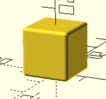
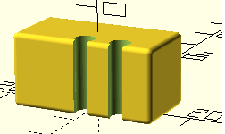
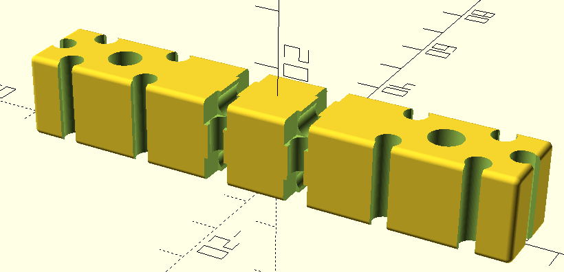
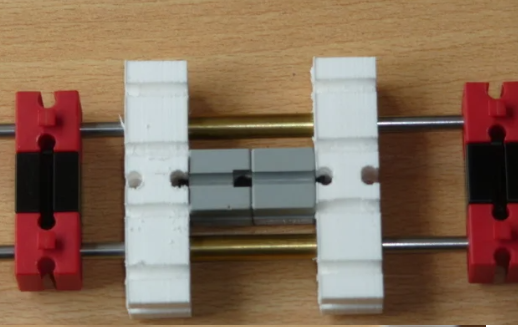

# FisherParts

## installation
- clone this repository to your Documents\OpenScad\libraries folder
- ~~change the path in the first line of the file FisherPart.scad~~


## samples

### Bricks

the brick module is defined like:
```scad
include <Fisher\FisherPart.scad>

brick(	height = 15, width = 15, depth = 15, 
        leftAxes_Vertical      = [], leftAxes_Horizontal    =[], 
        rightAxes_Vertical     = [], rightAxes_Horizontal   =[],
        bottomAxesFB           = [], topAxesFB              =[],
        bottomAxesLR           = [], topAxesLR              =[],
        frontAxes_Vertical     = [], frontAxes_Horizontal   =[], 
        backAxes_Vertical      = [], backAxes_Horizontal    =[],
        squareHoles             = false,
        triangleAxes            = false);

```
when called without parameters, like
```scad
//include <Fisher\FisherPart.scad>
include <Fisher\FisherBrick.scad>

brick();
```


it will provide a default brick (size 15mm * 15mm * 15mm) 


the module brick() privides parameters to provide mounting holes on all sides of the brick. Each parameter contains a set of mount holes relative to the center of the face is will be on, i.e. [0] will create a mount hole in the center of the face. All members of a set will be multiplied by 7.5 mm.

for example 
```scad
brick(	height                  =15, 
        width                   =30, 
        depth                   =15, 
        leftAxes_Vertical      =[], 
        leftAxes_Horizontal    =[], 
        rightAxes_Vertical     =[],
        rightAxes_Horizontal   =[],
        bottomAxesFB           =[], 
        topAxesFB              =[],
        bottomAxesLR           =[], 
        topAxesLR              =[],
        frontAxes_Vertical     =[0, 1], //  create two vertical mountholes
                                         //  (one in the center and one on 7.5mm)
        frontAxes_Horizontal   =[], 
        backAxes_Vertical      =[],
        backAxes_Horizontal    =[],
        squareHoles             =false,
        triangleAxes            =false
); 

// or just:
brick(	height                  =15, 
        width                   =30, 
        depth                   =15, 
        frontAxes_Vertical     =[0, 1]  //  create two vertical mountholes
                                         //  (one in the center and one on 7.5mm)
); 

// or even:
brick(	width                   =30, 
        frontAxes_Vertical     =[0, 1]  //  create two vertical mountholes
                                         //  (one in the center and one on 7.5mm)
); 
```



default bricks are defined in a number of modules in the include file FisherBrick.scad.

```scad
include <Fisher\FisherBrick.scad>


//brick_1_1(height=15);
//brick_1_2(height=15);
//brick_1_3(height=15);
brick_1_4(height=15);
//brick_1_5(height=15);
//brick_1_6(height=15);
//brick_1_7(height=15);
//brick_1_8(height=15);

//brick_2_2(height=15);
//brick_2_3(height=15);
//brick_2_4(height=15);
//brick_2_5(height=15);
//brick_2_6(height=15);
//brick_2_7(height=15);
//brick_2_8(height=15);
```
")

and finaly, my main reason to start 3D-printing anyway. I wanted to create my own gliders for linear motion. The 6mm holes in the gliders are meant for a brass tube, that will smoothly glide over a silversteel as. 

```scad
// gliders:

include <Fisher\FisherBrick.scad>
//brick_1_4_g(height=15, gliderAsDiameter=6);
brick_1_6_g(height=15, gliderAsDiameter=6);
//brick_1_8_g(height=15, gliderAsDiameter=6);

```


and can be used as



### Pins

```scad
include<Fisher/FisherPart.scad>

$fn=64;


translate([ 0,  0, 0])   pin_s_9_5();
translate([10,  0, 0])   pin_s_15();
 
translate([ 0, 20, 0])   pin_r_9_5();
translate([10, 20, 0])   pin_r_15();

translate([ 0, 40, 0])   pin_h_9_5();
translate([10, 40, 0])   pin_h_15();

```


```scad
include <Fisher\FisherPart.scad>

for(r = [15: 15: 210]) {
    translate([0, r-15, 0])
        batten(r);
    
    translate([0, -r, 0])
        batten(pyth(r, r));
}
```


